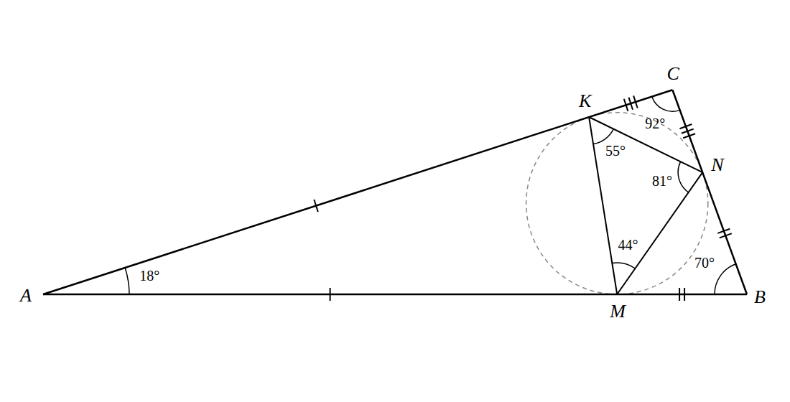
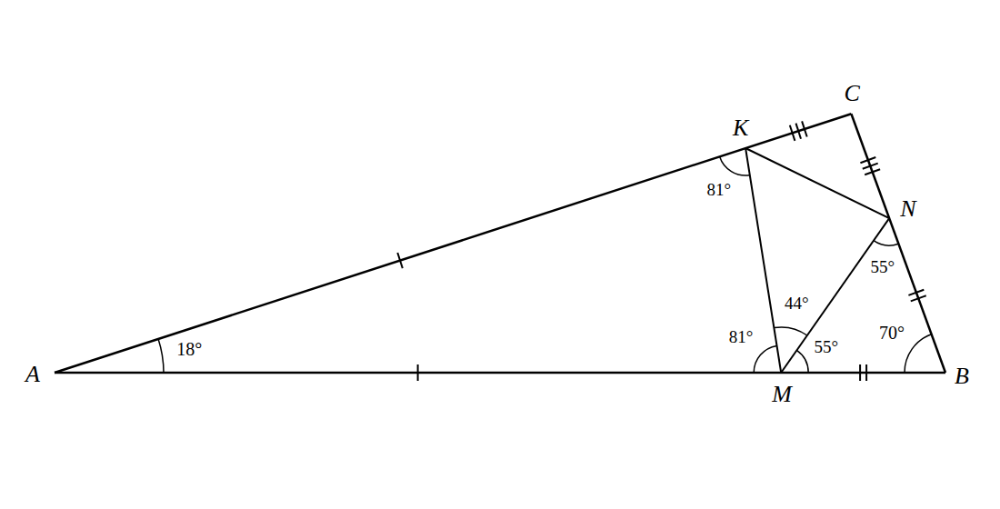

# «Высшая проба» 2022, отборочный этап, математика, 7 класс, день 1 — разбор

Все ответы совпадают с официальными и проверены перебором в `proverka.py`.

| № | Тема | Ответ |
|---|---|---|
| 1 | Разрезание квадрата, периметры | 5 |
| 2 | Рыцари, лжецы и хитрецы в круге | 23 |
| 3 | Углы треугольника, равнобедренные треугольники | 18 |
| 4 | Делители 60! | 8 |
| 5 | Раскраска отрезков клетчатого прямоугольника | 78 |
| 6 | Гири на весах | 5 |
| 7 | Пути короля | 189 |
| 8 | Аликвотные дроби | 5 |
| 9 | Разбиение на пары | 1 247 400 |
| 10 | Дороги и компании (раскраска графа) | 32 |

---

## 1. Квадрат на 3 прямоугольника, сумма периметров 40 → **5**

Пусть сторона квадрата a. Сумма периметров частей = периметр квадрата + удвоенная длина разрезов:
каждый разрез входит в периметры двух соседних кусков.

Три прямоугольника получаются только двумя способами:

- два параллельных разреза во всю сторону: длина разрезов 2a, сумма периметров 4a + 4a = **8a**;
- один разрез во всю сторону, второй — поперёк одного из кусков: длина разрезов a + (a − x), где 0 < x < a,
  сумма периметров 8a − 2x, то есть **строго меньше 8a**.

Итак, сумма периметров не больше 8a. Из 40 ≤ 8a получаем a ≥ 5. При a = 5 — три полосы 5×1, 5×1, 5×3
(или любые ширины с суммой 5): 8 · 5 = 40.

**Идея:** «сумма периметров = периметр + 2·длина разрезов».

## 2. Правдолюбы, лжецы, хитрецы; 70 человек в круге → **23**

Каждый говорит: «левый сосед — лжец», «правый сосед — хитрец».

1. **Два лжеца не стоят рядом.** Если лжец стоит слева от лжеца Л, то Л сказал «мой левый — лжец» — правду. Противоречие.
2. **Справа от лжеца — правдолюб.** Лжец сказал «правый — хитрец» — ложь, значит, правый не хитрец; и не лжец по п. 1.
3. **Справа от этого правдолюба — хитрец.** Правдолюб говорит правду: «правый — хитрец».

Значит, за каждым лжецом идут ещё двое: Л П Х, и эти тройки не перекрываются. Лжецов не больше ⌊70/3⌋ = 23.

**Пример:** 23 тройки «Л П Х» и ещё один хитрец (69 + 1 = 70). Проверка: у лжеца слева хитрец (не лжец —
«левый — лжец» ложно), справа правдолюб (не хитрец — «правый — хитрец» ложно); у правдолюба слева лжец, справа хитрец —
оба утверждения верны; хитрецы могут говорить что угодно.

## 3. Точки M, N, K; AM = AK, BM = BN, CN = CK → **18**

Рисунок построен точно (`risunok3.py`): углы ABC 18°, 70°, 92°; M, N, K — точки касания вписанной окружности.
Одинаковые засечки — равные отрезки из условия.

**Как расставить углы — по шагам (на примере точки M):**

1. Треугольник AMK равнобедренный (AM = AK), угол при вершине A. Углы при основании MK равны: (180° − A)/2.
   На рисунке (180 − 18)/2 = 81° — и при M, и при K.
2. Треугольник BMN равнобедренный (BM = BN), углы при основании MN: (180° − B)/2 = (180 − 70)/2 = 55°.
3. Точка M лежит на прямой AB, поэтому три угла при M в сумме дают развёрнутый угол:
   ∠AMK + ∠KMN + ∠NMB = 180°, то есть 81° + ∠KMN + 55° = 180°, ∠KMN = **44°**.
4. В общем виде: ∠KMN = 180° − (90° − A/2) − (90° − B/2) = (A + B)/2 = 90° − C/2.

**Правило:** угол треугольника MNK в точке на стороне равен 90° минус половина угла ABC **напротив этой стороны**.

| точка | на стороне | напротив вершина | угол MNK | угол ABC |
|---|---|---|---|---|
| M | AB | C | ∠M = 90° − C/2 | C = 180° − 2∠M |
| N | BC | A | ∠N = 90° − A/2 | A = 180° − 2∠N |
| K | CA | B | ∠K = 90° − B/2 | B = 180° − 2∠K |

В условии не сказано, какой из углов 44°, 55°, 81° где стоит, — и это не нужно. Каждый угол φ треугольника MNK
даёт свой угол 180° − 2φ треугольника ABC: 180 − 2·44 = 92, 180 − 2·55 = 70, 180 − 2·81 = 18.
Чем больше φ, тем меньше угол ABC, поэтому наименьший угол ABC даёт наибольший угол 81°: ответ **18**.
Проверка: 18 + 70 + 92 = 180.

**Замечание:** M, N, K — точки касания вписанной окружности, отсюда и формула 90° − угол/2.

## 4. Двузначные числа, не делящие 60! → **8**

- Простое p > 60 не делит 60! (в произведении 1·2·…·60 нет множителя p). Двузначные такие:
  61, 67, 71, 73, 79, 83, 89, 97 — **8 чисел**.
- Все остальные двузначные делят 60!:
  - простые до 60 входят множителем;
  - составное n = a·b, где 1 < a ≤ b; тогда b = n/a ≤ 99/2 < 60;
  - если a ≠ b, оба — разные множители в 60!;
  - если n = a² (только 16, 25, 36, 49, 64, 81), то a и 2a ≤ 18 — тоже разные множители, так что a² | 60!.

## 5. Прямоугольник 3 × 31, у каждой клетки ≤ 1 красной стороны → **78**

Каждый красный отрезок «занимает» клетки, которым он сторона: граничный — одну, внутренний — две.
Клеток 93, каждая занята не более одного раза.

Пусть b — красные граничные отрезки, i — внутренние. Тогда b + 2i ≤ 93.

Граничных клеток (первая и третья строки + две крайние клетки средней строки) 31 + 31 + 2 = 64,
и каждая может взять не больше одного граничного отрезка: b ≤ 64.

Всего b + i ≤ b + (93 − b)/2 = (93 + b)/2 ≤ 157/2 = 78,5, то есть **не больше 78**.

**Пример на 78:** у каждой из 64 граничных клеток красим одну её граничную сторону (угловым — любую одну из двух).
Внутри остаётся средняя строка без крайних клеток — 29 клеток подряд; красим 14 отрезков между клетками 1–2, 3–4, …, 27–28.
64 + 14 = 78.

## 6. Гири 1, 2, …, n и камень 57 г → **5**

Все гири лежат на весах. Пусть на чаше с камнем гири на S₁, на другой — S₂.
Тогда S₂ − S₁ = 57, S₁ + S₂ = n(n + 1)/2.
Значит, n(n + 1)/2 ≥ 57 и n(n + 1)/2 нечётно (сумма и разность одной чётности).

- n = 10: 55 < 57; n = 11: 66 — чётно; n = 12: 78 — чётно; **n = 13: 91** — подходит. Это «хорошее» n.
- S₁ = (91 − 57)/2 = 17.

Сколько разных гирь из 1…13 дают сумму 17? Шесть гирь весят минимум 1+2+…+6 = 21 > 17,
а пять можно: 1 + 2 + 3 + 4 + 7 = 17. Ответ **5**.

## 7. Король a1 → c8 за 7 ходов → **189**

Нужно подняться на 7 горизонталей за 7 ходов, значит, **каждый ход — ровно на одну горизонталь вверх**.
По вертикалям каждый ход сдвигает на −1, 0 или +1, всего нужно сместиться с a на c (+2), не выходя за край a.

Без учёта края: k ходов влево, k + 2 вправо, 5 − 2k прямо.

| k | число последовательностей |
|---|---|
| 0 | 7!/(0!·2!·5!) = 21 |
| 1 | 7!/(1!·3!·3!) = 140 |
| 2 | 7!/(2!·4!·1!) = 105 |

Итого 266.

Плохие пути заходят левее a (на «вертикаль −1»). Отражаем участок до первого такого захода относительно −1:
получаем пути из −2 в 2, то есть смещение +4 (k влево, k + 4 вправо, 3 − 2k прямо):
7!/(0!·4!·3!) + 7!/(1!·5!·1!) = 35 + 42 = 77.

266 − 77 = **189**. Правый край (вертикаль h) недостижим: чтобы уйти на h и вернуться на c, ходов не хватит.

## 8. Пары аликвотных дробей с аликвотной суммой > 1/6 → **5**

1/a + 1/b = 1/c, a < b, c ≤ 5 (сумма > 1/6), c ≥ 2 (сумма — правильная дробь).
Преобразование: (a − c)(b − c) = c². Каждый делитель d < c числа c² даёт пару a = c + d, b = c + c²/d.

| c | делители c², меньшие c | пары |
|---|---|---|
| 2 | 1 | 1/3 + 1/6 = 1/2 |
| 3 | 1 | 1/4 + 1/12 = 1/3 |
| 4 | 1, 2 | 1/5 + 1/20 = 1/4; 1/6 + 1/12 = 1/4 |
| 5 | 1 | 1/6 + 1/30 = 1/5 |

Итого **5**. (d = c дало бы a = b — дроби не различны.)

## 9. 12 девушек и 4 юноши, пары без двух юношей → **1 247 400**

В каждой паре не больше одного юноши, значит, каждый юноша стоит в паре с девушкой.

- Партнёрш юношам выбираем по очереди: 12 · 11 · 10 · 9 = 11 880.
- Оставшиеся 8 девушек разбиваем на 4 пары: 7 · 5 · 3 · 1 = 105
  (у первой 7 вариантов партнёрши, у следующей свободной — 5, и т. д.).

11 880 · 105 = **1 247 400**.

## 10. 500 дорог, компании за городами → **32**

Города — вершины, дороги — рёбра. Каждый город закреплён за компанией, компания ремонтирует половины всех дорог из своих городов.
«Никто не ремонтирует дорогу целиком» ⇔ **концы каждой дороги закреплены за разными компаниями**.
Это правильная раскраска вершин графа, компании — цвета. Надо найти наибольшее хроматическое число графа с 500 рёбрами.

- **Оценка.** Пусть граф раскрашен в наименьшее число цветов k. Между любыми двумя цветами есть ребро:
  иначе два цвета можно слить в один. Значит, рёбер ≥ k(k − 1)/2. При k = 33 это 528 > 500, поэтому k ≤ 32 всегда.
- **Пример на 32.** 32 города, каждые два соединены дорогой: 32 · 31/2 = 496 дорог, плюс 4 дороги где-нибудь ещё.
  Все 32 города попарно соседние — нужно 32 разные компании.

Ответ **32**.
